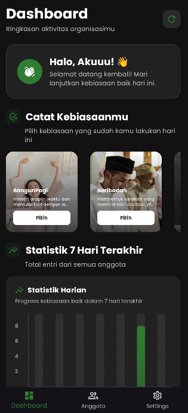

# 7 KAIH - Kebiasaan Anak Indonesia Hebat

**7 KAIH** (7 Kebiasaan Anak Indonesia Hebat) adalah sebuah aplikasi mobile yang dibangun menggunakan Flutter dan Firebase. Aplikasi ini dirancang untuk membantu anggota dalam sebuah organisasi atau tim untuk mencatat, melacak, dan memvisualisasikan progres dari 7 kebiasaan positif setiap hari.

Aplikasi ini menerapkan model data *multi-tenant*, di mana setiap organisasi memiliki ruang datanya sendiri yang terisolasi, memastikan privasi dan keamanan data.

## Fitur Utama

- **🔐 Autentikasi Pengguna:** Sistem Sign Up & Sign In yang aman menggunakan Firebase Authentication.
- **🏢 Manajemen Organisasi:**
    - Buat organisasi baru dan dapatkan peran sebagai Admin.
    - Gabung ke organisasi yang sudah ada menggunakan ID unik.
- **📊 Dashboard Real-time:**
    - **Input Kebiasaan:** Catat aktivitas harian untuk 7 kebiasaan yang telah ditentukan.
    - **Grafik Kontribusi:** Visualisasikan total kontribusi harian dari seluruh anggota dalam bentuk diagram batang.
    - **Papan Peringkat (Leaderboard):** Lihat peringkat 3 anggota paling aktif di organisasi.
- **👥 Halaman Anggota:**
    - Tampilan data lengkap performa **seluruh** anggota organisasi.
    - Informasi ringkas mengenai total anggota, *streak* pribadi, dan peringkat.
- **⚙️ Halaman Pengaturan:**
    - Ganti antara mode Terang (Light) dan Gelap (Dark).
    - Ganti atau keluar dari organisasi.
    - Logout.
- **📱 Desain Responsif:** Tampilan otomatis beradaptasi antara mode *desktop/tablet* (dengan navigasi samping) dan mode *mobile* (dengan navigasi bawah).

## Teknologi yang Digunakan

- **Framework:** [Flutter](https://flutter.dev/)
- **Backend & Database:** [Firebase](https://firebase.google.com/) (Authentication, Cloud Firestore, Storage)
- **Manajemen State:** [Bloc/Cubit](https://bloclibrary.dev/)
- **Arsitektur:** Clean Architecture (UI > UseCase > Repository > Data Source)
- **Lainnya:** `dartz`, `hydrated_bloc`, `fl_chart`, `image_picker`.

## Cara Menjalankan Proyek Secara Lokal

Untuk menjalankan proyek ini di komputer Anda, ikuti langkah-langkah berikut:

1.  **Prasyarat:**
    - pastikan vscode sudah terupdate ke versi terbaru.
    - Pastikan Anda sudah menginstal [Flutter SDK](https://flutter.dev/docs/get-started/install) kemudian versi paling terbaru dan yang stable.
    - Anda memerlukan akun Firebase untuk backend.
    - (opsional)instal visual studio dan centang yang desktop development with c++ saat instalasi

2.  **Clone Repository:**
    ```bash
    git clone https://github.com/NAMA_ANDA/NAMA_REPO_ANDA.git
    cd NAMA_REPO_ANDA
    ```

3. **Penyiapan Backend (Firebase)**

Aplikasi ini tidak bisa berjalan tanpa terhubung ke backend Firebase. Anda harus membuat dan mengonfigurasi proyek Firebase Anda sendiri.

---

#### **Langkah 3a: Buat Proyek Firebase**

1.  Buka [Firebase Console](https://console.firebase.google.com/) di browser Anda dan login dengan akun Google.
2.  Klik **"Add project"** atau **"Buat project"**.
3.  Masukkan nama proyek (misalnya, `KAIH App Dev`) dan terima persyaratan.
4.  Klik **"Create project"** dan tunggu hingga selesai.

---

#### **Langkah 3b: Aktifkan Layanan yang Dibutuhkan**

Di dalam dashboard proyek Firebase yang baru Anda buat, Anda perlu "menyalakan" tiga layanan utama.

1.  **Authentication (Untuk Login & Daftar):**
    - Di menu navigasi kiri, klik **Build > Authentication**.
    - Klik tombol **"Get started"**.
    - Di bawah tab "Sign-in method", pilih provider **"Email/Password"**.
    - **Aktifkan (Enable)** provider tersebut dan klik **Save**.

2.  **Cloud Firestore (Untuk Database):**
    - Di menu navigasi kiri, klik **Build > Firestore Database**.
    - Klik tombol **"Create database"**.
    - Pilih untuk memulai dalam **"Production mode"**. Klik **Next**.
    - Pilih lokasi Cloud Firestore (pilih yang terdekat dengan Anda, misalnya `asia-southeast2` untuk Jakarta). Klik **Enable**.
    - **PENTING:** Setelah database dibuat, pergi ke tab **"Rules"**. Ganti aturannya menjadi seperti di bawah ini agar Anda bisa menulis dan membaca data selama pengembangan. **Jangan gunakan aturan ini di aplikasi produksi!**
      ```javascript
      rules_version = '2';
      service cloud.firestore {
        match /databases/{database}/documents {
          // Izinkan baca dan tulis jika pengguna sudah login
          match /{document=**} {
            allow read, write: if request.auth != null;
          }
        }
      }
      ```
    - Klik **"Publish"**.

3.  **Cloud Storage (Untuk Upload Gambar) (jika firebase nya diupgrade ke spark jika tidak perlu bisa skip bagian ini):**
    - Di menu navigasi kiri, klik **Build > Storage**.
    - Klik tombol **"Get started"**.
    - Pilih untuk memulai dalam **"Production mode"**. Klik **Next**.
    - Pastikan lokasinya sama dengan Firestore Anda, lalu klik **Done**.
    - **PENTING:** Sama seperti Firestore, pergi ke tab **"Rules"**. Ganti aturannya agar pengguna yang sudah login bisa mengunggah dan melihat gambar.
      ```javascript
      rules_version = '2';
      service firebase.storage {
        match /b/{bucket}/o {
          // Izinkan baca dan tulis jika pengguna sudah login
          match /{allPaths=**} {
            allow read, write: if request.auth != null;
          }
        }
      }
      ```
    - Klik **"Publish"**.

---

#### **Langkah 3c: Hubungkan Proyek Flutter ke Firebase**

Ini adalah langkah terakhir untuk membuat "jembatan" antara kode Anda dan backend Firebase.

1.  **Instal Firebase CLI & FlutterFire CLI (Jika Belum Ada):**
    - Buka terminal di komputer Anda dan jalankan perintah-perintah ini jika Anda belum pernah menggunakannya:
      ```bash
      # Instal Firebase CLI
      npm install -g firebase-tools

      # Instal FlutterFire CLI
      dart pub global activate flutterfire_cli
      ```

2.  **Login ke Firebase:**
    - Di terminal, jalankan perintah ini. Sebuah jendela browser akan terbuka untuk Anda login.
      ```bash
      firebase login
      ```

3.  **Konfigurasi Proyek:**
    - Sekarang, kembali ke terminal yang sudah berada **di dalam direktori proyek Flutter Anda** (`kaih_7_xirpl2`).
    - Jalankan perintah ajaib ini:
      ```bash
      flutterfire configure
      ```
    - **Ikuti Instruksinya:**
      - Alat ini akan menampilkan daftar proyek Firebase Anda. Gunakan tombol panah untuk **memilih proyek** yang baru saja Anda buat.
      - Ia akan menanyakan platform mana yang ingin Anda konfigurasi (android, ios, web, macos). Pilih platform yang Anda butuhkan (Anda bisa memilih beberapa dengan menekan spasi). Tekan Enter.
      - Alat ini akan secara otomatis mendaftarkan aplikasi Anda di Firebase, mengunduh file konfigurasi yang diperlukan, dan yang terpenting, membuat file `lib/firebase_options.dart`.

Setelah `flutterfire configure` selesai, proyek Anda sudah **sepenuhnya terhubung** ke backend Firebase Anda. Sekarang Anda bisa melanjutkan ke langkah berikutnya.

4.  **Jalankan Aplikasi:**
    - Ambil semua dependensi di pubspec.yaml tinggal save atau:
      ```bash
      flutter pub get
      ```
    - Jalankan aplikasi:
      ```bash
      flutter run
      ```

## Screenshot Aplikasi 


| Halaman Dashboard | Halaman Dashboard Hp|
| :---: | :---: |
|  |  |

---
